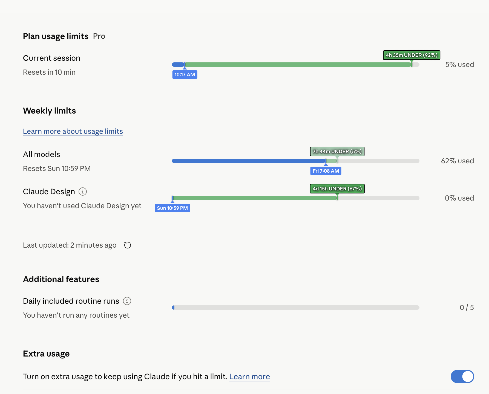
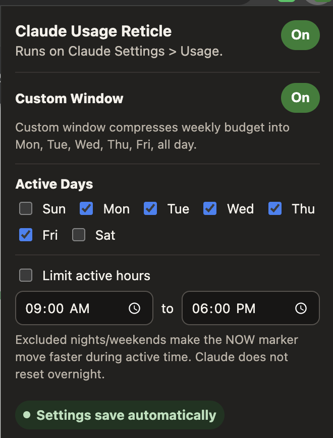

# Claude Usage Reticle

A pace tracker for Claude usage limits. It overlays Claude's Usage page with a reticle that compares your actual usage against where you would be if you spread that limit evenly across the reset window.





## What It Does

Adds two markers to supported Claude usage bars (`Settings > Usage`):

1. **Blue usage marker** - Shows where your current usage sits, converted to an equivalent time in the reset window
2. **Delta marker** - Shows how far OVER or UNDER the expected pace you are

### Visual Indicators

- **Green overlay + label** = Under budget (you have capacity to spare)
- **Red glow + overlay + label** = Over budget (consider slowing down)
- **Color intensity** scales with how far off budget you are

### Example Reading

If your label shows `1d 5h OVER (15%)`, it means your usage is 15 percentage points ahead of the even-spend pace, equivalent to about 1 day and 5 hours of active window time.

Tracks only the bars where a time-based pace comparison makes sense:
- Current session (5-hour window)
- All models (weekly)
- Other weekly bars that share the weekly reset window

It deliberately ignores fixed-count feature bars such as Daily included routine runs.

The Chrome extension also supports optional custom windows for weekly bars, such as weekdays 9-5. This compresses the same reset-window budget into active time; it does not change Claude's reset time. The bookmarklet intentionally stays simple and has no settings panel.

## Installation

### Option 1: Chrome Extension (Recommended)

For automatic running with no script manager required:

1. Download the project ZIP from [GitHub](https://github.com/NemesisHubris/claude-usage-reticle/archive/refs/heads/main.zip), or clone the repo locally
2. Unzip it and keep the folder somewhere stable
3. Open `chrome://extensions`
4. Enable **Developer mode**
5. Click **Load unpacked**
6. Select the unzipped `extension` folder
7. Visit [claude.ai/settings/usage](https://claude.ai/settings/usage)

The extension popup controls on/off state and custom budget-window settings.

To update: replace the local project folder with the latest download, then click the extension reload button in `chrome://extensions`.

### Option 2: Bookmarklet (No Install)

1. Visit the **[installation page](https://nemesishubris.github.io/claude-usage-reticle/bookmarklet.html)**
2. **Chrome/Edge**: Drag the button to your bookmarks bar
   **Firefox**: Click Copy, create a new bookmark, paste as URL
3. Go to [claude.ai/settings/usage](https://claude.ai/settings/usage)
4. Click the bookmark

Click the bookmark whenever you want to inject the reticles on the current page. The bookmarklet uses the standard full reset windows and does not add custom-window controls.

### Option 3: Firefox Temporary Extension

For local Firefox testing:

1. Open `about:debugging#/runtime/this-firefox`
2. Click **Load Temporary Add-on**
3. Select `extension/manifest.json`
4. Visit [claude.ai/settings/usage](https://claude.ai/settings/usage)

The extension is scoped to `https://claude.ai/settings/*` for Claude SPA navigation, but the script exits without reading page text unless the current path is `/settings/usage`. Extension users configure the tracker from the extension popup, not from an in-page Claude panel.

## How It Works

### Position Calculation

The expected pace marker is calculated as:

```
Current Session: (5 - hours_until_reset) / 5 * 100%
Weekly Limits:   (168 - hours_until_reset) / 168 * 100%
```

For example, if your weekly limit resets Saturday at 11 AM and it's currently Wednesday at 5 PM, about 103 hours have passed out of 168, so the expected pace marker is at about 61%.

### Color Scaling

The delta label color uses dynamic scaling:
- **Floor**: 35% minimum intensity (even small differences are visible)
- **Speed**: 2x scaling (reaches full intensity at 50% difference)
- **Formula**: `intensity = 0.35 + 0.65 * min(abs(diff) / 100 * 2, 1)`

Colors range from near-white (small difference) to fully saturated (large difference):
- Green: `hsl(142, 5-75%, 95-40%)`
- Red: `hsl(0, 5-80%, 95-40%)`

## Features

| Feature | Description |
|---------|-------------|
| Time delta | Shows difference as "1d 5h OVER" or "2h 30m UNDER" |
| Percentage | Displays exact percentage difference in parentheses |
| Usage time | Blue marker shows equivalent day/time for your usage |
| Color scaling | Dynamic intensity based on how far off budget |
| Red glow | Over-budget state shows glow effect around overlay |
| Green fill | Under-budget state shows solid green overlay |
| Custom windows | Weekly bars can compress expected pace into active days/hours |
| Event-driven refresh | Updates on page changes, focus, and visibility changes instead of fixed polling |
| Soft shadows | Text has soft drop shadow for readability |

## Limitations

- The script relies on Claude's current page structure. If Anthropic updates their UI, it may need updating.
- The bookmarklet installs a page-local observer. Click it again after a full page reload.

**Last tested:** May 2026

## Files

| File | Purpose |
|------|---------|
| `bookmarklet.html` | Installation page with drag-to-install button and clean embedded bookmarklet injector |
| `usage-reticle.user.js` | Full injector source used by the browser extension content script |
| `extension/` | Manifest V3 browser extension package |
| `test-time-parsing.html` | Unit tests for time calculation |
| `color-calibrator.html` | Development tool for tuning color scaling |

## Version History

### v2.5 (Current)
- Added a dedicated Manifest V3 browser extension package for Chrome/Firefox
- Extension popup controls enable/disable and custom budget-window settings
- Extension no longer renders the Usage Reticle Budget Window inside Claude
- Fixed Current session filtering when Claude includes plan badges in the section heading
- Removes stale reticles from unsupported bars like Daily included routine runs
- Simplified the bookmarklet injector by removing custom-window controls from bookmarklet mode
- Switched tracker injection to Claude's live `aria-label="Usage"` progressbars
- Uses nearest `Resets...` block and supported row title detection for reliable rendering
- Moves the settings panel below Extra usage instead of between usage sections

### v2.4
- Added custom active day/hour budget windows for weekly bars
- Replaced fixed minute polling with mutation/focus/visibility refreshes
- Added a page-local settings panel persisted in localStorage

### v2.3
- Tightened detection to current Claude Usage sections and supported rows
- Added singleton cleanup to prevent duplicate bookmarklet injections

### v2.2
- Reworked bar detection for Claude's newer Usage UI
- Bookmarklet support added for no-install usage

### v2.0
- Usage time reticle showing equivalent day/time
- Delta reticle with time difference and percentage
- Dynamic color scaling with 35% floor and 2x speed
- Green overlay for under budget, red glow for over budget
- Soft shadow text styling for contrast
- Firefox compatibility with copy-to-clipboard fallback (bookmarklet)
- SPA navigation support

### v1.5 (Legacy)
- Single NOW reticle showing current time position
- Basic red marker with triangular arrows

## License

MIT - Use it, share it, modify it.

---

*Made for the Claude community. Not affiliated with Anthropic.*
